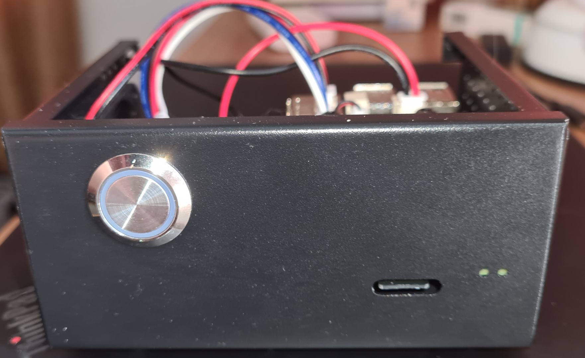
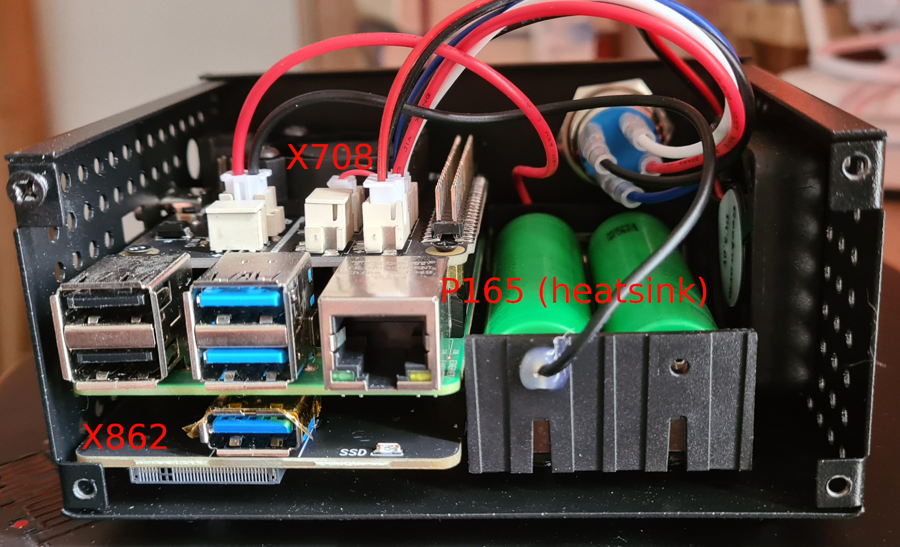

### Playbook to provision a [Raspberry Pi OS (64-bit)](https://www.raspberrypi.com/software/operating-systems/#raspberry-pi-os-64-bit) with following hardware add-ons.
- Power management using [x708 v1.2](https://wiki.geekworm.com/X708-Hardware)
- USB boot using [x862 v2.0](https://wiki.geekworm.com/X862_V2.0).  https://pibenchmarks.com/benchmark/58555
- Case with monentary power button [X857-C3](https://wiki.geekworm.com/X857-C3)


### Requirement
1. ansible  2.12.x
2. python 3.8.x
3. jmespath 1.0.0 via pip3

### How-To
1. Install your ssh public key to  your pi (w/ sudoer ) user 
1. Update/create inventory.yml
```
cp inventory.yml.sample inventory.yml
```
1. Create vars.yml. 
```
cp vars.yml.sample vars.yml
```
1. Run ansible
```
ansible-playbook -i inventory.yml -e @vars.yml provision.yml -l rpi4
```

### Image



